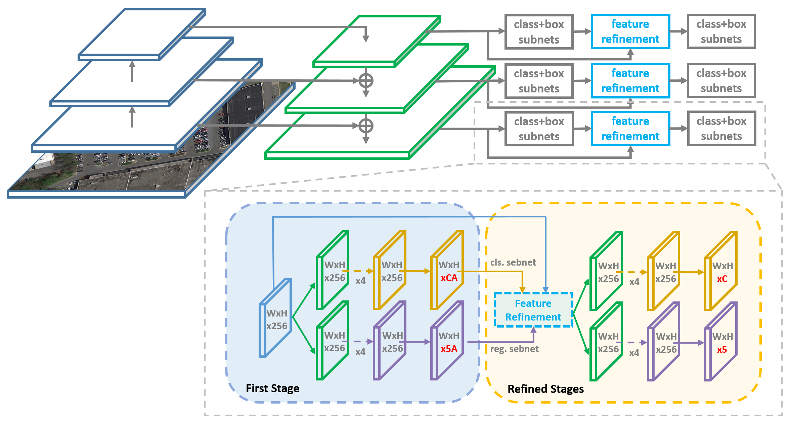

# R<sup>3</sup>Det on MMDetection
# R<sup>3</sup>Det: Refined Single-Stage Detector with Feature Refinement for Rotating Object

## Abstract
- [R<sup>3</sup>Det](https://arxiv.org/abs/1908.05612) and [R<sup>3</sup>Det++](https://arxiv.org/abs/2004.13316) are based on [Focal Loss for Dense Object Detection](https://arxiv.org/pdf/1708.02002.pdf), and it is completed by [YangXue](https://yangxue0827.github.io/).
- MMDetection is an open source object detection toolbox based on PyTorch. It is
a part of the OpenMMLab project developed by [Multimedia Laboratory, CUHK](http://mmlab.ie.cuhk.edu.hk/).

Reference Repository
- https://github.com/Thinklab-SJTU/R3Det_Tensorflow.git
- https://github.com/open-mmlab/mmdetection.git

Techniques:     
- [x] [ResNet](https://arxiv.org/abs/1512.03385), [MobileNetV2](https://arxiv.org/abs/1801.04381), [EfficientNet](https://arxiv.org/abs/1905.11946)
- [x] [Feature Refinement Module (FRM)](https://arxiv.org/abs/1908.05612)
- [x] [Instance Level Denoising (InLD)](https://arxiv.org/abs/2004.13316)
- [x] [IoU-Smooth L1 Loss](https://arxiv.org/abs/1811.07126)
- [x] [Circular Smooth Label (CSL)](https://arxiv.org/abs/2003.05597)
- [x] Anchor Free (one anchor per feature point)

This repo implements R<sup>3</sup>Det with following configurations:
- resnet50 + FPN + FRM + 2-refine-stages

Code specific to this repo includes:
- PyTorch implementation of R<sup>3</sup>Det
- CUDA version of FRM (feature refine module) as PyTorch extension

## Pipeline


## Performance
More results and trained models are available in the [MODEL_ZOO.md](MODEL_ZOO.md).
### DOTA1.0
| Model |    Backbone    |    Training data    |    Val data    |    mAP   | GPU | Image/GPU | Anchor | Reg. Loss| lr schd | Data Augmentation | Configs |       
|:------------:|:------------:|:------------:|:---------:|:-----------:|:----------:|:-----------:|:---------:|:---------:|:---------:|:---------:|:---------:|     
| [R<sup>3</sup>Det*](https://arxiv.org/abs/1908.05612) (this-repo) | ResNet50 (PyTorch) 600->800 | DOTA1.0 trainval | DOTA1.0 test | 71.90 | **1X** GeForce RTX 2080 Ti | 6 | H + R | smooth L1 | cannot compare | No | configs / r3det / r3det_r50_fpn_1x_CustomizeImageSplit.py |
| [R<sup>3</sup>Det](https://arxiv.org/abs/1908.05612) | ResNet50_v1d 600->800 | DOTA1.0 trainval | DOTA1.0 test | 65.73 | 8X GeForce RTX 2080 Ti | 1 | H + R | smooth L1 | 2x | No | cfgs_res50_dota_r3det_v1.py |
| [R<sup>3</sup>Det*](https://arxiv.org/abs/1908.05612) | ResNet50_v1d 600->800 | DOTA1.0 trainval | DOTA1.0 test | 67.20 | 8X GeForce RTX 2080 Ti | 1 | H + R | smooth L1 | 2x | No | cfgs_res50_dota_r3det_v2.py |
| [R<sup>3</sup>Det*](https://arxiv.org/abs/1908.05612) | ResNet50_v1d 600->800 | DOTA1.0 trainval | DOTA1.0 test | 69.50 | 4X GeForce RTX 2080 Ti | 1 | H + R | [**iou-smooth L1**](https://arxiv.org/abs/1811.07126) | 2x | No | cfgs_res50_dota_r3det_v12.py |
| [R<sup>3</sup>Det](https://arxiv.org/abs/1908.05612) | **ResNet101_v1d** 600->800 | DOTA1.0 trainval | DOTA1.0 test | 71.69 | 8X GeForce RTX 2080 Ti | 1 | H + R | smooth L1 | 3x | Yes | - |
| [R<sup>3</sup>Det](https://arxiv.org/abs/1908.05612) | **ResNet152_v1d** 600->800 | DOTA1.0 trainval | DOTA1.0 test | 72.81 | 8X GeForce RTX 2080 Ti | 1 | H + R | smooth L1 | **4x** | Yes | - |
| [R<sup>3</sup>Det*](https://arxiv.org/abs/1908.05612) | **ResNet152_v1d** 600->800 | DOTA1.0 trainval | DOTA1.0 test | 73.74 | 8X GeForce RTX 2080 Ti | 1 | H + R | smooth L1 | **4x** | Yes | - |
|  |  |  |  |  |  |  |  |  |  |  |  |  |
| **[R<sup>3</sup>Det++](https://yangxue0827.github.io/SCRDet++.html)** | ResNet50_v1d 600->800 | DOTA1.0 trainval | DOTA1.0 test | 69.07 | 8X GeForce RTX 2080 Ti | 1 | H + R | smooth L1 | 2x | No | cfgs_res50_dota_r3det_plusplus_v2.py |
| [R<sup>3</sup>Det++](https://yangxue0827.github.io/SCRDet++.html) | ResNet50_v1d 600->800 | DOTA1.0 trainval | DOTA1.0 test | 70.08 | 4X GeForce RTX 2080 Ti | 1 | H + R | [**iou-smooth L1**](https://arxiv.org/abs/1811.07126) | 2x | No | cfgs_res50_dota_r3det_plusplus_v9.py |
| [R<sup>3</sup>Det++](https://yangxue0827.github.io/SCRDet++.html) | **ResNet152_v1d** 600->800 | DOTA1.0 trainval | DOTA1.0 test | 74.41 | 8X GeForce RTX 2080 Ti | 1 | H + R | smooth L1 | 4x | Yes | - |
| [R<sup>3</sup>Det++](https://yangxue0827.github.io/SCRDet++.html) | ResNet152_v1d **MS** | DOTA1.0 trainval | DOTA1.0 test | 76.56 | 4X GeForce RTX 2080 Ti | 1 | H + R + more | smooth L1 | 6x | Yes | cfgs_res152_dota_r3det_plusplus_v1.py |

[R<sup>3</sup>Det*](https://arxiv.org/abs/1908.05612): R<sup>3</sup>Det with two refinement stages
**The performance of all models comes from the source [paper](https://arxiv.org/abs/1908.05612).**       
                  
## Download Model
### Pretrain weights
* [Baidu Drive](https://pan.baidu.com/s/1Ijmh1Lco4T7HPwAtT2h0Zg), password: u8bj.

## Citation

If this is useful for your research, please consider cite.

```
@article{yang2020arbitrary,
    title={Arbitrary-Oriented Object Detection with Circular Smooth Label},
    author={Yang, Xue and Yan, Junchi},
    journal={arXiv preprint arXiv:2003.05597},
    year={2020}
}

@article{yang2019r3det,
    title={R3Det: Refined Single-Stage Detector with Feature Refinement for Rotating Object},
    author={Yang, Xue and Liu, Qingqing and Yan, Junchi and Li, Ang and Zhang, Zhiqiang and Yu, Gang},
    journal={arXiv preprint arXiv:1908.05612},
    year={2019}
}

@article{yang2020scrdet++,
    title={SCRDet++: Detecting Small, Cluttered and Rotated Objects via Instance-Level Feature Denoising and Rotation Loss Smoothing},
    author={Yang, Xue and Yan, Junchi and Yang, Xiaokang and Tang, Jin and Liao, Wenglong and He, Tao},
    journal={arXiv preprint arXiv:2004.13316},
    year={2020}
}

@inproceedings{yang2019scrdet,
    title={SCRDet: Towards more robust detection for small, cluttered and rotated objects},
    author={Yang, Xue and Yang, Jirui and Yan, Junchi and Zhang, Yue and Zhang, Tengfei and Guo, Zhi and Sun, Xian and Fu, Kun},
    booktitle={Proceedings of the IEEE International Conference on Computer Vision (ICCV)},
    pages={8232--8241},
    year={2019}
}

@inproceedings{xia2018dota,
    title={DOTA: A large-scale dataset for object detection in aerial images},
    author={Xia, Gui-Song and Bai, Xiang and Ding, Jian and Zhu, Zhen and Belongie, Serge and Luo, Jiebo and Datcu, Mihai and Pelillo, Marcello and Zhang, Liangpei},
    booktitle={Proceedings of the IEEE Conference on Computer Vision and Pattern Recognition (CVPR)},
    pages={3974--3983},
    year={2018}
}

@article{mmdetection,
  title   = {{MMDetection}: Open MMLab Detection Toolbox and Benchmark},
  author  = {Chen, Kai and Wang, Jiaqi and Pang, Jiangmiao and Cao, Yuhang and
             Xiong, Yu and Li, Xiaoxiao and Sun, Shuyang and Feng, Wansen and
             Liu, Ziwei and Xu, Jiarui and Zhang, Zheng and Cheng, Dazhi and
             Zhu, Chenchen and Cheng, Tianheng and Zhao, Qijie and Li, Buyu and
             Lu, Xin and Zhu, Rui and Wu, Yue and Dai, Jifeng and Wang, Jingdong
             and Shi, Jianping and Ouyang, Wanli and Loy, Chen Change and Lin, Dahua},
  journal= {arXiv preprint arXiv:1906.07155},
  year={2019}
}
```

## Reference
1、https://github.com/Thinklab-SJTU/R3Det_Tensorflow.git  
2、https://github.com/open-mmlab/mmdetection.git  
3、https://github.com/endernewton/tf-faster-rcnn   
4、https://github.com/zengarden/light_head_rcnn   
5、https://github.com/tensorflow/models/tree/master/research/object_detection    
6、https://github.com/fizyr/keras-retinanet     
